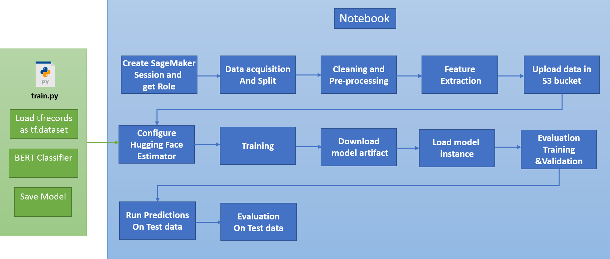

# Injury narrative classification using BERT with Hugging Face and Amazon SageMaker

## Overview
In 2018 National Institute for Occupational Safety and Health (NIOSH), along with NASA, worked with Topcoder to organize an intramural and extramural (international) Natural language processing competition to classify unstructured free-text "injury narratives" recorded in surveillance system into injury codes from the Occupational Injuries and Illnesses Classification System (OIICS).
This project uses out-of-box state of the art model from the Hugging Face transformer library to classify injury narrative text and use SageMaker to run the experiment at scale. This an example learning project for ML practioner.

## Workflow

This is the workflow to build, train and evaluate a model in SageMaker

